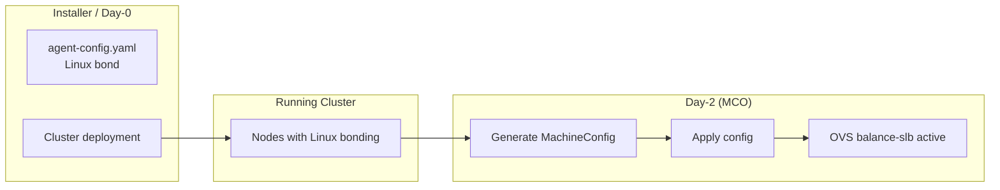

# How to configure OVS balance-slb bonding on OpenShift agent-based deployments

This approach leverages generally available OpenShift components, including Open vSwitch (OVS), nmstate, and the Machine Config Operator, and does not introduce unsupported behaviors or bypass platform management mechanisms.

## Environment

- Red Hat OpenShift Container Platform 4.19, 4.20
- Agent-based installer deployments
- OVN-Kubernetes network plugin
- Bare metal nodes with 2 physical NICs
- Physical switch ports configured as 802.1Q trunk (LACP/LAG not required)

> **Note:** This procedure was validated on OpenShift 4.19 and 4.20. Future OpenShift versions may introduce changes to nmstate handling or OVS configuration. Verify compatibility before applying to newer versions.

## Issue

Customers deploying OpenShift using the agent-based installer on bare metal need network redundancy without LACP/LAG switch configuration. The `agent-config.yaml` network configuration does not support OVS balance-slb bonding mode.

**Limitations of agent-based installer:**

| Bond Mode | Supported in agent-config.yaml? | Switch Requirement |
|-----------|--------------------------------|-------------------|
| active-backup | Yes | None |
| 802.3ad (LACP) | Yes | LACP/LAG required |
| balance-xor | Yes | None with `xmit_hash_policy: vlan+srcmac` |
| balance-slb | **No** | None |

OVS balance-slb provides load distribution across links without requiring switch-side configuration, but cannot be configured during agent-based installation and must be applied post-installation via MachineConfig.

## Resolution

Deploy nmstate configuration files via MachineConfig after the agent-based installation completes. The `nmstate-configuration.service` (OpenShift component) automatically applies the configuration based on hostname.

**This approach uses only product-provided interfaces:**
- `/etc/nmstate/openshift/<hostname>.yml` - Standard nmstate configuration path
- `nmstate-configuration.service` - OpenShift's nmstate service
- MachineConfig - Standard OpenShift configuration method
- Machine Config Operator (MCO) - Manages node configuration and rollout

### Deployment Strategy

For agent-based deployments, the recommended approach is:

1. **Install the cluster** using `agent-config.yaml` with a supported bond mode (e.g., `active-backup`)
2. **Post-installation**, apply the balance-slb configuration via MachineConfig
3. **MCO handles the migration** from Linux bond to OVS balance-slb

### Prerequisites

| Requirement | Description |
|-------------|-------------|
| 2 NICs | Each node must have 2 physical NICs for the bond |
| Node inventory | Short hostname, IP, prefix, VLAN, gateway, DNS for each node |
| Switch configuration | Trunk ports allowing required VLANs (no LACP needed) |
| Console access | BMC/IPMI/iLO/iDRAC access for emergency recovery |
| Core user password | Set password for `core` user on nodes for console login |

> **Important:** Before applying this configuration, ensure you have console access to the nodes and have set a password for the `core` user. This is critical for troubleshooting if network connectivity is lost during the configuration process.

### Typical Workflow for Agent-Based Deployments



#### Installation phase (Day-0)

| Aspect                | Description                                                         |
| --------------------- | ------------------------------------------------------------------- |
| Installer             | Agent-based installer                                               |
| Network configuration | Defined in `agent-config.yaml`                                      |
| Bonding mode          | `active-backup`                                                     |
| Network stack         | Linux bonding                                                       |
| Cluster state         | Fully supported and GA                                              |
| Limitation            | OVS `balance-slb` not available at install time when using two NICs |


#### Post-installation phase (Day-2)

| Aspect              | Description                           |
| ------------------- | ------------------------------------- |
| Trigger             | Manual post-installation procedure    |
| Input               | Node inventory file                   |
| Automation          | Helper script generates MachineConfig |
| Applied by          | Machine Config Operator (MCO)         |
| Node impact         | Controlled reboot during rollout      |
| Network stack       | Open vSwitch                          |
| Bonding mode        | `balance-slb`                         |
| Switch requirements | No switch-side LACP required          |
| Outcome             | Linux bond fully replaced by OVS bond |


#### Why this approach

| Topic                  | Rationale                                             |
| ---------------------- | ----------------------------------------------------- |
| Separation of concerns | Keeps installation GA and supported                   |
| Risk management        | Day-2 change handled by MCO                           |
| Operational safety     | Gradual rollout per MCP                               |
| Documentation gap      | Provides a supported path not covered in install docs |


### Rollout Options

After the agent-based installation completes, there are two approaches for applying the balance-slb configuration:

| Option | Use Case | Behavior |
|--------|----------|----------|
| **Option A: Standard Rollout** | Non-critical environments, maintenance windows | MCO automatically reboots all nodes in the pool (rolling) |
| **Option B: Controlled Rollout** | Production environments, node-by-node control | You control which nodes are updated via labeling |

---

## Option A: Standard Rollout (Post-Installation)

Use this option when:
- You have a maintenance window
- All nodes in the pool can be updated
- MCO's rolling update is acceptable

### Procedure

#### Step 1: Create Node Inventory File

```bash
cat > nodes.conf << 'EOF'
# HOSTNAME         IP              PREFIX  VLAN  GATEWAY        NIC1   NIC2   DNS
worker-01          10.132.254.21   24      100   10.132.254.10  ens33  ens34  10.132.254.102,10.132.254.103
worker-02          10.132.254.22   24      100   10.132.254.10  ens33  ens34  10.132.254.102,10.132.254.103
worker-03          10.132.254.23   24      100   10.132.254.10  ens33  ens34  10.132.254.102,10.132.254.103
EOF
```

**Field descriptions:**

| Field | Description | Example |
|-------|-------------|---------|
| HOSTNAME | **Short hostname** - output of `hostname -s` | worker-01 |
| IP | Node IP address | 10.132.254.21 |
| PREFIX | Network prefix length (without /) | 24 |
| VLAN | 802.1Q VLAN ID | 100 |
| GATEWAY | Default gateway | 10.132.254.10 |
| NIC1 | First physical NIC | ens33 |
| NIC2 | Second physical NIC | ens34 |
| DNS_SERVERS | Comma-separated DNS servers | 10.132.254.102,10.132.254.103 |

#### Step 2: Generate MachineConfig

For worker nodes:

```bash
./generate-balance-slb-machineconfig.sh \
  --nodes nodes.conf \
  --role worker \
  --name 99-ovs-balance-slb-worker \
  --output balance-slb-machineconfig-worker.yaml
```

For master nodes:

```bash
./generate-balance-slb-machineconfig.sh \
  --nodes masters.conf \
  --role master \
  --name 99-ovs-balance-slb-master \
  --output balance-slb-machineconfig-master.yaml
```

#### Step 3: Apply MachineConfig

```bash
oc apply -f balance-slb-machineconfig-<role>.yaml
```

#### Step 4: Monitor Rollout

```bash
# Watch MachineConfigPool status
oc get mcp -w

# Watch nodes
oc get nodes -w
```

The MCO will:
1. Cordon and drain each node
2. Reboot the node
3. Apply the new configuration
4. Uncordon the node
5. Proceed to the next node

**Note**: If the MachineConfigPool is updated on all nodes but the nodes do not reboot automatically, perform a manual reboot to ensure the balance-slb configuration takes effect.

#### Step 5: Verify Configuration

After all nodes return to `Ready` state:

```bash
for node in $(oc get nodes -l node-role.kubernetes.io/worker -o name); do
  echo "=== $node ==="
  oc debug $node -- chroot /host ovs-appctl bond/show ovs-bond 2>/dev/null | grep -E "bond_mode|may_enable"
done
```

Expected output:
```
bond_mode: balance-slb
may_enable: true
may_enable: true
```

---

## Option B: Controlled Rollout (Post-Installation)

Use this option when:
- Production environment requires node-by-node control
- You need to verify each node before proceeding
- Rollback capability is required

### Controlled Rollout for Worker Nodes

This approach uses a custom MachineConfigPool. Nodes only receive the configuration when explicitly labeled.

**Note**: A custom MachineConfigPool is used to target a subset of worker nodes while preserving inheritance from the default worker pool.
Network reconfiguration is applied post-installation via the Machine Config Operator, ensuring a fully supported Day-2 migration from Linux bonding to OVS balance-slb.

#### Procedure

##### Step 1: Create Node Inventory File

Same as Option A.

##### Step 2: Generate MachineConfig with Custom MCP

```bash
./generate-balance-slb-machineconfig.sh \
  --nodes nodes.conf \
  --role worker-balance-slb \
  --create-mcp \
  --output balance-slb-machineconfig-worker.yaml
```

This generates:
1. A MachineConfigPool named `worker-balance-slb` (inherits from `worker`)
2. A MachineConfig targeting that pool

**Note**: Custom MCPs can only be created from the worker pool.

##### Step 3: Apply MachineConfig and MCP

```bash
oc apply -f balance-slb-machineconfig-worker.yaml
```

At this point, **nothing happens** - no nodes have the required label yet.

Verify the MCP was created:

```bash
oc get mcp worker-balance-slb
```

##### Step 4: Label First Node

```bash
oc label node worker-01 node-role.kubernetes.io/worker-balance-slb=""
```

The node will:
1. Move from `worker` pool to `worker-balance-slb` pool
2. Be cordoned and drained
3. Reboot
4. Apply the balance-slb configuration
5. Return to `Ready` state

Monitor:

```bash
oc get mcp worker-balance-slb -w
oc get node worker-01 -w
```

##### Step 5: Verify First Node

```bash
oc debug node/worker-01 -- chroot /host ovs-appctl bond/show ovs-bond
```

Expected output includes:
```
bond_mode: balance-slb
may_enable: true
may_enable: true
```

Verify NIC master:

```bash
oc debug node/worker-01 -- chroot /host ip link show ens33 | grep master
# Expected: master ovs-system
```

##### Step 6: Proceed with Remaining Nodes

Once verified, label the next node:

```bash
oc label node worker-02 node-role.kubernetes.io/worker-balance-slb=""
# Wait and verify...

oc label node worker-03 node-role.kubernetes.io/worker-balance-slb=""
# Wait and verify...
```

##### Step 7: Rollback (if needed)

To revert a node to the default worker pool, remove the label:

```bash
oc label node worker-01 node-role.kubernetes.io/worker-balance-slb-
```

The node will:
1. Move back to the `worker` pool
2. Reboot
3. Apply the standard worker configuration

> **Note:** The nmstate files remain on the node but are not applied because the node reverts to the worker pool's configuration.

---

### Controlled Rollout for Master Nodes

Custom MachineConfigPools cannot inherit from the `master` pool due to cluster admission policies. To control the rollout timing for master nodes, use the pause/unpause approach:

#### Procedure

##### Step 1: Pause the master pool before applying

```bash
oc patch mcp master --type=merge -p '{"spec":{"paused":true}}'
```

##### Step 2: Apply the MachineConfig

The rollout will not start while the pool is paused.

```bash
oc apply -f master-balance-slb-machineconfig.yaml
```

* See Option A, Step 2 for generating MachineConfig for masters.

##### Step 3: Unpause when ready

```bash
oc patch mcp master --type=merge -p '{"spec":{"paused":false}}'
```

##### Step 4: Monitor the rollout

```bash
oc get mcp master -w
```

#### Notes

- While paused, you can verify the MachineConfig was created correctly before triggering the rollout
- The MCO will perform a rolling update of all master nodes once unpaused
- To limit concurrent updates, set `maxUnavailable`:
  ```bash
  oc patch mcp master --type=merge -p '{"spec":{"maxUnavailable":1}}'
  ```

---

## Generated MachineConfig Structure

The helper script generates MachineConfig resources compatible with agent-based deployed clusters.

### Option A: Standard MachineConfig

```yaml
apiVersion: machineconfiguration.openshift.io/v1
kind: MachineConfig
metadata:
  labels:
    machineconfiguration.openshift.io/role: worker
  name: 99-ovs-balance-slb
spec:
  config:
    ignition:
      version: 3.2.0
    storage:
      files:
      - path: /etc/nmstate/openshift/worker-01.yml
        mode: 0644
        overwrite: true
        contents:
          source: data:text/plain;charset=utf-8;base64,<BASE64_ENCODED>
      - path: /etc/nmstate/openshift/worker-02.yml
        # ...
```

### Option B: MachineConfig with Custom MCP

```yaml
---
apiVersion: machineconfiguration.openshift.io/v1
kind: MachineConfigPool
metadata:
  name: worker-balance-slb
spec:
  machineConfigSelector:
    matchExpressions:
    - key: machineconfiguration.openshift.io/role
      operator: In
      values:
      - worker
      - worker-balance-slb
  nodeSelector:
    matchLabels:
      node-role.kubernetes.io/worker-balance-slb: ""
  paused: false

---
apiVersion: machineconfiguration.openshift.io/v1
kind: MachineConfig
metadata:
  labels:
    machineconfiguration.openshift.io/role: worker-balance-slb
  name: 99-ovs-balance-slb
spec:
  config:
    ignition:
      version: 3.2.0
    storage:
      files:
      - path: /etc/nmstate/openshift/worker-01.yml
        # ...
```

---

## nmstate Configuration Example

Each node receives an nmstate file at `/etc/nmstate/openshift/<hostname>.yml`. This configuration:
- Removes the existing Linux bond configured during agent-based installation (`bond0`, `bond0.XXX`)
- Creates the OVS balance-slb topology (`br-ex`, `br-phy`, `ovs-bond`)
- Migrates the node IP from the Linux bond VLAN interface to `br-ex`

```yaml
interfaces:
  # Remove existing Linux bond
  - name: bond0
    type: bond
    state: absent

  - name: bond0.100
    type: vlan
    state: absent

  # OVS external bridge
  - name: br-ex
    type: ovs-bridge
    state: up
    ipv4:
      enabled: false
      dhcp: false
    ipv6:
      enabled: false
      dhcp: false
    bridge:
      allow-extra-patch-ports: true
      port:
      - name: br-ex
      - name: patch-ex-to-phy
    ovs-db:
      external_ids:
        bridge-uplink: "patch-ex-to-phy"

  # br-ex interface with node IP
  - name: br-ex
    type: ovs-interface
    state: up
    mtu: 9000
    copy-mac-from: ens33
    ipv4:
      enabled: true
      address:
      - ip: 10.132.254.21
        prefix-length: 24
    ipv6:
      enabled: false
      dhcp: false

  # Physical bridge with OVS bond
  - name: br-phy
    type: ovs-bridge
    state: up
    ipv4:
      enabled: false
      dhcp: false
    ipv6:
      enabled: false
      dhcp: false
    bridge:
      allow-extra-patch-ports: true
      port:
      - name: patch-phy-to-ex
        vlan:
          mode: access
          tag: 100
      - name: ovs-bond
        link-aggregation:
          mode: balance-slb
          port:
          - name: ens33
          - name: ens34

  # Patch ports
  - name: patch-ex-to-phy
    type: ovs-interface
    state: up
    patch:
      peer: patch-phy-to-ex

  - name: patch-phy-to-ex
    type: ovs-interface
    state: up
    patch:
      peer: patch-ex-to-phy

  # Physical NICs
  - name: ens33
    type: ethernet
    state: up
    mtu: 9000
    ipv4:
      enabled: false
    ipv6:
      enabled: false

  - name: ens34
    type: ethernet
    state: up
    mtu: 9000
    ipv4:
      enabled: false
    ipv6:
      enabled: false

dns-resolver:
  config:
    server:
    - 10.132.254.102
    - 10.132.254.103

routes:
  config:
  - destination: 0.0.0.0/0
    next-hop-address: 10.132.254.10
    next-hop-interface: br-ex

ovn:
  bridge-mappings:
    - bridge: br-phy
      localnet: vmnet
      state: present
```

---

## Architecture

---


---


---

**Key differences:**

| Aspect | Linux Bond | OVS Balance-SLB |
|--------|------------|-----------------|
| Bond type | Kernel bond (bond0) | OVS bond (ovs-bond) |
| NIC master | `master bond0` | `master ovs-system` |
| VLAN handling | bond0.XXX interface | Patch port with access tag |
| Node IP location | bond0.XXX | br-ex |
| Switch requirement | LACP for 802.3ad | None |

---

## Root Cause

The agent-based installer validates network configuration in `agent-config.yaml` against a schema that does not include OVS-native bond modes. Balance-slb is an OVS-specific mode, not a Linux kernel bond mode, and cannot be specified during installation.

| Configuration Method | Supports balance-slb | Reason |
|---------------------|---------------------|--------|
| agent-config.yaml | No | Schema validation rejects OVS bond modes |
| NMStateConfig CR | No | Same schema validation |
| MachineConfig + nmstate | **Yes** | Direct nmstate, post-install |

The path `/etc/nmstate/openshift/` is the product-provided interface for custom nmstate configurations. The `nmstate-configuration.service` automatically loads `$(hostname -s).yml` during boot, allowing post-installation network reconfiguration.

---

## Diagnostic Steps

**Check MachineConfigPool status:**

```bash
oc get mcp
oc describe mcp worker-balance-slb
```

**Verify nmstate file exists:**

```bash
oc debug node/<node> -- chroot /host ls -la /etc/nmstate/openshift/
```

**Check nmstate file content:**

```bash
oc debug node/<node> -- chroot /host cat /etc/nmstate/openshift/<hostname>.yml
```

**Check bond status:**

```bash
oc debug node/<node> -- chroot /host ovs-appctl bond/show ovs-bond
```

**Check OVS bridge structure:**

```bash
oc debug node/<node> -- chroot /host ovs-vsctl show
```

**Verify NICs are OVS slaves:**

```bash
oc debug node/<node> -- chroot /host ip link show ens33
# Expected: master ovs-system state UP
```

**Check nmstate-configuration service:**

```bash
oc debug node/<node> -- chroot /host systemctl status nmstate-configuration.service
oc debug node/<node> -- chroot /host journalctl -u nmstate-configuration.service
```

### Emergency Recovery via Console

If a node loses network connectivity:

1. **Access via BMC/IPMI/iLO/iDRAC console**

2. **Login as core user:**
   ```
   login: core
   Password: <password>
   ```

3. **Check status:**
   ```bash
   sudo -i
   ip addr show
   ovs-vsctl show
   journalctl -u nmstate-configuration.service
   ```

4. **Manually reapply if needed:**
   ```bash
   nmstatectl apply /etc/nmstate/openshift/$(hostname -s).yml
   ```

5. **Verify connectivity:**
   ```bash
   ping <gateway>
   ```

---

## Additional Information

### Tested Versions

| OpenShift Version | Status | Notes |
|-------------------|--------|-------|
| 4.19.x | Validated | Tested with 4.19.20 |
| 4.20.x | Validated | Tested with 4.20.10 |
| 4.21+ | Not tested | Verify before use |

### Upgrade Behavior

The balance-slb configuration persists through cluster upgrades:
- MachineConfig is preserved
- nmstate files in `/etc/nmstate/openshift/` are preserved
- No manual intervention required after upgrade

### Helper Script

The `generate-balance-slb-machineconfig.sh` script is available to generate the MachineConfig from a node inventory file.

**Options:**

| Option | Description |
|--------|-------------|
| `--nodes <file>` | Node inventory file (required) |
| `--role <role>` | MachineConfig role (default: worker) |
| `--mtu <mtu>` | MTU size (default: 9000) |
| `--output <file>` | Output filename |
| `--name <name>` | MachineConfig name |
| `--create-mcp` | Generate custom MCP for controlled rollout |

**Examples:**

```bash
# Standard rollout (all workers)
./generate-balance-slb-machineconfig.sh \
  --nodes nodes.conf \
  --role worker

# Controlled rollout (node-by-node)
./generate-balance-slb-machineconfig.sh \
  --nodes nodes.conf \
  --role worker-balance-slb \
  --create-mcp

# Masters
./generate-balance-slb-machineconfig.sh \
  --nodes masters.conf \
  --role master \
  --name 99-ovs-balance-slb-master
```

### Future Compatibility

This procedure relies on:
1. MachineConfig support in OpenShift
2. `nmstate-configuration.service` loading from `/etc/nmstate/openshift/`
3. OVS balance-slb bond mode support in nmstate
4. Agent-based installer producing clusters compatible with post-installation MachineConfig

Future OpenShift versions may:
- Add native support for balance-slb in `agent-config.yaml` (making this procedure unnecessary)
- Change nmstate handling or OVS configuration interfaces

Consult OpenShift documentation for your version before applying this procedure.

---

## Related Solutions

- How to configure OVS balance-slb bonding on OpenShift HCP worker nodes