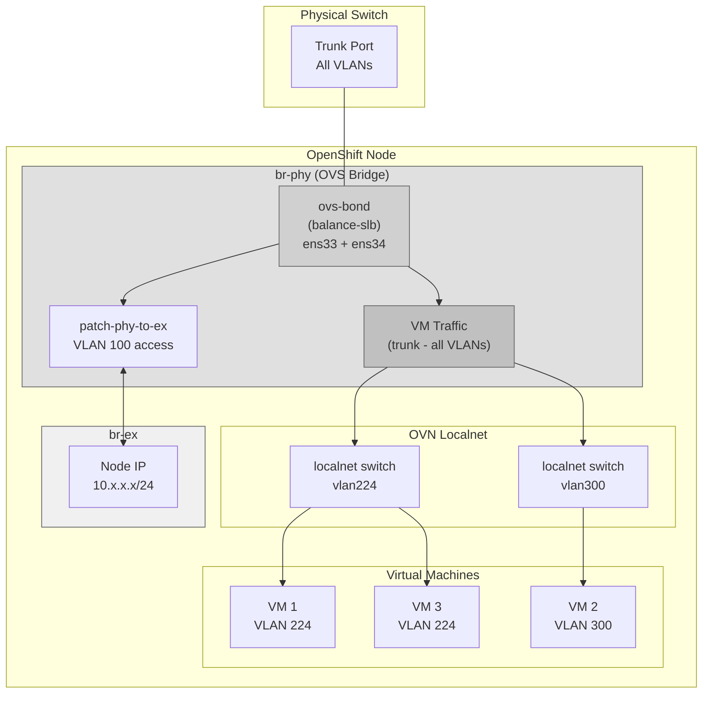
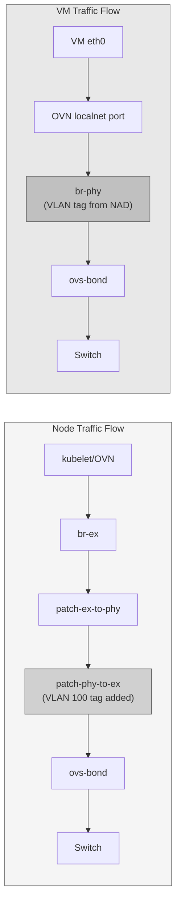
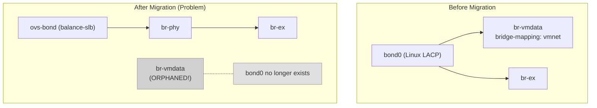
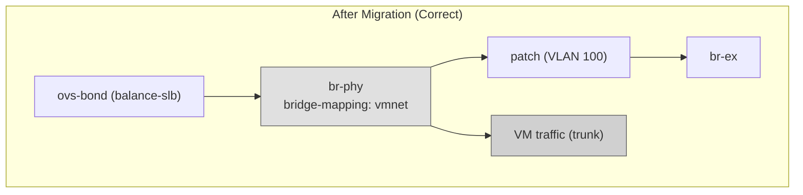
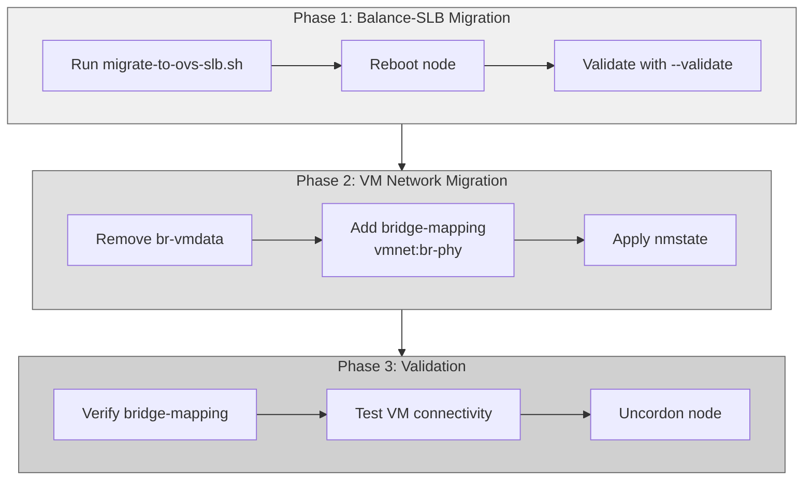

# OpenShift Virtualization Network Configuration
# OVS Balance-SLB with VM Localnet Support

## Document Information

| Field | Value |
|-------|-------|
| Version | 1.1 |
| Tested On | OpenShift 4.20.8 (HCP Agent Nodes) |
| Last Updated | January 2026 |
| Prerequisites | OVS Balance-SLB migration completed |

---

## Table of Contents

1. [Overview](#1-overview)
2. [Architecture](#2-architecture)
3. [Prerequisites](#3-prerequisites)
4. [Migrating from br-vmdata](#4-migrating-from-br-vmdata)
5. [Configuration Procedure](#5-configuration-procedure)
6. [Creating NetworkAttachmentDefinitions](#6-creating-networkattachmentdefinitions)
7. [Attaching VMs to Networks](#7-attaching-vms-to-networks)
8. [Validation](#8-validation)
9. [Troubleshooting](#9-troubleshooting)

---

## 1. Overview

This document describes how to configure OpenShift Virtualization VM networking using the OVS balance-slb architecture. VMs can access any VLAN through the same physical bond used for node traffic, with proper isolation maintained by OVN flows.

### Traffic Flow Summary

| Traffic Type | Path | VLAN Handling |
|--------------|------|---------------|
| Node (API, OVN overlay) | br-phy → patch port (VLAN 100) → br-ex | Access mode (strips/adds tag) |
| VM (localnet) | br-phy → ovs-bond → switch | Trunk (OVN applies VLAN tag) |

### Benefits of This Architecture

- **Single bond for all traffic**: No need for separate bridges
- **Balance-SLB distribution**: VMs with different MACs use different physical links
- **Any VLAN support**: VMs can use any VLAN allowed on the trunk
- **Simplified management**: One nmstate configuration handles everything
- **Better VM load distribution**: Per-source-MAC hashing vs per-flow (LACP)

---

## 2. Architecture

### Network Topology



### Traffic Isolation

Node traffic and VM traffic share the same physical bond but are isolated:



**Key Point**: VM traffic does NOT pass through the patch port. It goes directly from br-phy to the bond with the VLAN tag applied by OVN.

---

## 3. Prerequisites

### Completed Steps

Before proceeding, ensure:

- [ ] OVS balance-slb migration completed on all nodes
- [ ] All nodes showing `balance-slb` in `check-cluster-bond.sh`
- [ ] MetalLB L2Advertisement updated (removed `bond0.100`)
- [ ] Physical switch ports configured as trunk (all required VLANs allowed)

### Verify Current Configuration

```bash
# On each node, verify OVS structure
ovs-vsctl show

# Expected output should show:
# - br-ex with patch-ex-to-phy
# - br-phy with ovs-bond and patch-phy-to-ex
```

### Check for Existing br-vmdata

If your cluster previously used a dedicated `br-vmdata` bridge, you must migrate it. See [Section 4: Migrating from br-vmdata](#4-migrating-from-br-vmdata).

```bash
# Check if br-vmdata exists
ovs-vsctl list-br | grep br-vmdata

# Check current bridge-mappings
ovs-vsctl get Open_vSwitch . external_ids:ovn-bridge-mappings
```

---

## 4. Migrating from br-vmdata

### 4.1 The Problem

If your cluster had a dedicated `br-vmdata` bridge using `bond0` as port, the migration to balance-slb creates an issue:



After migration:
- `bond0` (Linux bond) no longer exists
- `br-vmdata` loses its uplink and becomes orphaned
- VMs using `br-vmdata` lose connectivity

### 4.2 Solution: Remove br-vmdata, Use br-phy

The solution is to:
1. Remove the orphaned `br-vmdata` bridge
2. Update bridge-mapping to use `br-phy` instead
3. NADs remain unchanged (still use `physicalNetworkName: vmnet`)



### 4.3 Pre-Migration Inventory

Before migrating any node, document current state:

```bash
# Create inventory file
cat > vmnet-inventory.txt << 'EOF'
=== VM Network Inventory ===
Date: $(date)
EOF

# Document NADs
echo -e "\n=== NetworkAttachmentDefinitions ===" >> vmnet-inventory.txt
oc get net-attach-def -A >> vmnet-inventory.txt

# Document NAD details
echo -e "\n=== NAD Configurations ===" >> vmnet-inventory.txt
oc get net-attach-def -A -o yaml >> vmnet-inventory.txt

# Document current bridge-mappings per node
echo -e "\n=== Bridge Mappings per Node ===" >> vmnet-inventory.txt
for node in $(oc get nodes -o name | cut -d/ -f2); do
  echo "--- $node ---" >> vmnet-inventory.txt
  oc debug node/$node -- chroot /host \
    ovs-vsctl get Open_vSwitch . external_ids:ovn-bridge-mappings 2>/dev/null >> vmnet-inventory.txt
done

# Document VMs with additional networks
echo -e "\n=== VMs with Additional Networks ===" >> vmnet-inventory.txt
oc get vm -A -o jsonpath='{range .items[*]}{.metadata.namespace}/{.metadata.name}: {.spec.template.spec.networks[*].multus.networkName}{"\n"}{end}' >> vmnet-inventory.txt

# Save backup of NADs
oc get net-attach-def -A -o yaml > nads-backup.yaml

echo "Inventory saved to vmnet-inventory.txt"
echo "NAD backup saved to nads-backup.yaml"
```

### 4.4 Migration Procedure (Per Node)

Execute these steps for each node, one at a time:

#### Step 1: Prepare

```bash
# Cordon the node
oc adm cordon <node-name>

# Optional: Live migrate VMs to other nodes
# This avoids VM downtime during node migration
for vm in $(oc get vmi -A --field-selector spec.nodeName=<node-name> -o name); do
  virtctl migrate $vm
done

# Wait for migrations to complete
oc get vmi -A -w
```

#### Step 2: Run Balance-SLB Migration

```bash
# Via node console (NOT SSH!)
sudo -i
cd /tmp
./migrate-to-ovs-slb.sh --ip <NODE_IP>
reboot
```

#### Step 3: Post-Reboot Cleanup

```bash
# SSH to node (now works)
ssh core@<node-ip>
sudo -i

# Check for orphaned br-vmdata
ovs-vsctl list-br
ovs-vsctl show | grep -A5 br-vmdata

# Remove orphaned br-vmdata
ovs-vsctl del-br br-vmdata
echo "br-vmdata removed"

# Verify it's gone
ovs-vsctl list-br
# Should show only: br-ex, br-phy, br-int
```

#### Step 4: Configure Bridge-Mapping

```bash
# Verify nmstate file has ovn section
grep -A5 "^ovn:" /etc/nmstate/$(hostname -s).yml

# If missing, add it
cat >> /etc/nmstate/$(hostname -s).yml << 'EOF'

ovn:
  bridge-mappings:
    - bridge: br-phy
      localnet: vmnet
      state: present
EOF

# Apply nmstate
nmstatectl apply /etc/nmstate/$(hostname -s).yml

# Verify bridge-mapping
ovs-vsctl get Open_vSwitch . external_ids:ovn-bridge-mappings
# Expected: "vmnet:br-phy"
```

#### Step 5: Validate and Uncordon

```bash
# Validate balance-slb
./migrate-to-ovs-slb.sh --validate

# From bastion: uncordon
oc adm uncordon <node-name>

# Verify node is Ready
oc get node <node-name>
```

#### Step 6: Test VM Connectivity

```bash
# If VMs were migrated away, they can return now
# Or test any VM that was scheduled back to this node

# Access VM console
virtctl console <vm-name>

# Inside VM: test connectivity
ip addr show
ping <vlan-gateway>
```

### 4.5 Migration Checklist

| Step | Action | Verification |
|------|--------|--------------|
| 1 | Create inventory | `cat vmnet-inventory.txt` |
| 2 | Backup NADs | `cat nads-backup.yaml` |
| 3 | Cordon node | `oc get node` shows SchedulingDisabled |
| 4 | Migrate VMs (optional) | `oc get vmi -A` shows VMs on other nodes |
| 5 | Run balance-slb migration | Script completes successfully |
| 6 | Reboot | Node comes back up |
| 7 | Remove br-vmdata | `ovs-vsctl list-br` shows no br-vmdata |
| 8 | Add bridge-mapping | `ovs-vsctl get ... ovn-bridge-mappings` shows `vmnet:br-phy` |
| 9 | Validate | `--validate` passes |
| 10 | Uncordon | Node is Ready and schedulable |
| 11 | Test VMs | VMs have connectivity |
| 12 | Repeat for next node | - |

### 4.6 Important Notes

- **NADs do not change**: The `physicalNetworkName: vmnet` in NADs remains the same
- **VMs do not change**: No VM reconfiguration needed
- **One node at a time**: Ensure each node is fully working before proceeding
- **VM live migration**: If possible, migrate VMs before node maintenance to avoid downtime

---

## 5. Configuration Procedure

### 5.1 Add Bridge-Mapping to nmstate

The bridge-mapping tells OVN which OVS bridge to use for localnet traffic.

#### Edit Existing nmstate File

```bash
# SSH to node
ssh core@<node-ip>
sudo -i

# Edit the nmstate file
vi /etc/nmstate/$(hostname -s).yml
```

Add the following section at the end of the file (same indentation level as `interfaces:`, `dns-resolver:`, `routes:`):

```yaml
ovn:
  bridge-mappings:
    - bridge: br-phy
      localnet: vmnet
      state: present
```

#### Complete Example File

```yaml
interfaces:
  - name: br-ex
    type: ovs-bridge
    # ... (existing configuration)

  - name: br-phy
    type: ovs-bridge
    # ... (existing configuration)

  # ... (other interfaces)

dns-resolver:
  config:
    server:
    - 10.132.254.102
    - 10.132.254.103

routes:
  config:
  - destination: 0.0.0.0/0
    next-hop-address: 10.132.254.10
    next-hop-interface: br-ex

# ADD THIS SECTION
ovn:
  bridge-mappings:
    - bridge: br-phy
      localnet: vmnet
      state: present
```

### 5.2 Apply Configuration

```bash
# Apply the updated nmstate
cd /etc/nmstate
nmstatectl apply $(hostname -s).yml

# Verify bridge-mapping was applied
ovs-vsctl get Open_vSwitch . external_ids:ovn-bridge-mappings
```

**Expected Output:**
```
"vmnet:br-phy"
```

### 5.3 Repeat for All Nodes

Apply the same bridge-mapping configuration to all worker nodes that will host VMs.

```bash
# Quick verification script (run from bastion)
for node in $(oc get nodes -o name | cut -d/ -f2); do
  echo "=== $node ==="
  oc debug node/$node -- chroot /host \
    ovs-vsctl get Open_vSwitch . external_ids:ovn-bridge-mappings 2>/dev/null
done
```

**Expected Output:**
```
=== ocp-worker-01 ===
"vmnet:br-phy"
=== ocp-worker-02 ===
"vmnet:br-phy"
=== ocp-worker-03 ===
"vmnet:br-phy"
```

---

## 6. Creating NetworkAttachmentDefinitions

### 6.1 Basic NAD for a Single VLAN

```yaml
apiVersion: k8s.cni.cncf.io/v1
kind: NetworkAttachmentDefinition
metadata:
  name: vlan224
  namespace: default
spec:
  config: |-
    {
      "cniVersion": "0.4.0",
      "name": "vlan224",
      "type": "ovn-k8s-cni-overlay",
      "topology": "localnet",
      "netAttachDefName": "default/vlan224",
      "physicalNetworkName": "vmnet",
      "vlanID": 224,
      "mtu": 9000
    }
```

### 6.2 NAD Configuration Parameters

| Parameter | Description | Example |
|-----------|-------------|---------|
| `name` | NAD identifier | `vlan224` |
| `type` | CNI plugin | `ovn-k8s-cni-overlay` (always) |
| `topology` | Network topology | `localnet` (always for external VLANs) |
| `physicalNetworkName` | Must match bridge-mapping localnet name | `vmnet` |
| `vlanID` | VLAN tag to apply | `224` |
| `mtu` | Maximum transmission unit | `9000` |

### 6.3 Create Multiple NADs

```bash
# Create NADs for different VLANs
cat <<'EOF' | oc apply -f -
---
apiVersion: k8s.cni.cncf.io/v1
kind: NetworkAttachmentDefinition
metadata:
  name: vlan100-production
  namespace: openshift-cnv
spec:
  config: |-
    {
      "cniVersion": "0.4.0",
      "name": "vlan100-production",
      "type": "ovn-k8s-cni-overlay",
      "topology": "localnet",
      "netAttachDefName": "openshift-cnv/vlan100-production",
      "physicalNetworkName": "vmnet",
      "vlanID": 100,
      "mtu": 9000
    }
---
apiVersion: k8s.cni.cncf.io/v1
kind: NetworkAttachmentDefinition
metadata:
  name: vlan200-development
  namespace: openshift-cnv
spec:
  config: |-
    {
      "cniVersion": "0.4.0",
      "name": "vlan200-development",
      "type": "ovn-k8s-cni-overlay",
      "topology": "localnet",
      "netAttachDefName": "openshift-cnv/vlan200-development",
      "physicalNetworkName": "vmnet",
      "vlanID": 200,
      "mtu": 9000
    }
---
apiVersion: k8s.cni.cncf.io/v1
kind: NetworkAttachmentDefinition
metadata:
  name: vlan300-management
  namespace: openshift-cnv
spec:
  config: |-
    {
      "cniVersion": "0.4.0",
      "name": "vlan300-management",
      "type": "ovn-k8s-cni-overlay",
      "topology": "localnet",
      "netAttachDefName": "openshift-cnv/vlan300-management",
      "physicalNetworkName": "vmnet",
      "vlanID": 300,
      "mtu": 9000
    }
EOF
```

### 6.4 Verify NADs

```bash
# List all NADs
oc get net-attach-def -A

# Check specific NAD
oc get net-attach-def vlan224 -n default -o yaml
```

---

## 7. Attaching VMs to Networks

### 7.1 VM with Single Additional Network

```yaml
apiVersion: kubevirt.io/v1
kind: VirtualMachine
metadata:
  name: vm-example
  namespace: default
spec:
  running: true
  template:
    spec:
      domain:
        devices:
          interfaces:
          - name: default
            masquerade: {}
          - name: vlan224-net
            bridge: {}
        # ... (other domain config)
      networks:
      - name: default
        pod: {}
      - name: vlan224-net
        multus:
          networkName: default/vlan224
```

### 7.2 VM with Multiple Networks

```yaml
apiVersion: kubevirt.io/v1
kind: VirtualMachine
metadata:
  name: vm-multi-network
  namespace: default
spec:
  running: true
  template:
    spec:
      domain:
        devices:
          interfaces:
          - name: default
            masquerade: {}
          - name: production-net
            bridge: {}
          - name: management-net
            bridge: {}
      networks:
      - name: default
        pod: {}
      - name: production-net
        multus:
          networkName: openshift-cnv/vlan100-production
      - name: management-net
        multus:
          networkName: openshift-cnv/vlan300-management
```

### 7.3 Add Network to Existing VM

```bash
# Stop VM first
virtctl stop vm-example

# Edit VM to add network
oc edit vm vm-example
# Add interface and network entries as shown above

# Start VM
virtctl start vm-example
```

---

## 8. Validation

### 8.1 Verify OVN Configuration

```bash
# Check bridge-mappings on a node
oc debug node/<node-name> -- chroot /host \
  ovs-vsctl get Open_vSwitch . external_ids:ovn-bridge-mappings

# Check localnet switches created by OVN
oc debug node/<node-name> -- chroot /host \
  ovn-nbctl ls-list | grep localnet
```

### 8.2 Verify OVS Flows

```bash
# On the node, check flows on br-phy
oc debug node/<node-name> -- chroot /host \
  ovs-ofctl dump-flows br-phy

# Should show NORMAL action for trunk traffic
```

### 8.3 Verify VM Connectivity

```bash
# Access VM console
virtctl console vm-example

# Inside VM - check interface
ip addr show

# Test connectivity to gateway on the VLAN
ping <vlan-gateway-ip>

# Test connectivity to another VM on same VLAN
ping <other-vm-ip>
```

### 8.4 Verify Balance-SLB Distribution

With multiple VMs, traffic should be distributed across both NICs:

```bash
# On the node
oc debug node/<node-name> -- chroot /host \
  ovs-appctl bond/show ovs-bond

# Look for traffic distribution across members:
# member ens33: enabled
#   hash 45: 1234 kB load
#   hash 128: 5678 kB load
# member ens34: enabled
#   hash 12: 2345 kB load
#   hash 200: 6789 kB load
```

### 8.5 Verify br-vmdata is Gone

```bash
# Ensure old bridge was removed
oc debug node/<node-name> -- chroot /host ovs-vsctl list-br

# Expected: br-ex, br-int, br-phy (NO br-vmdata)
```

### 8.6 Complete Validation Checklist

| # | Check | Command | Expected |
|---|-------|---------|----------|
| 1 | No br-vmdata | `ovs-vsctl list-br` | Only br-ex, br-int, br-phy |
| 2 | Bridge-mapping exists | `ovs-vsctl get Open_vSwitch . external_ids:ovn-bridge-mappings` | `"vmnet:br-phy"` |
| 3 | NAD created | `oc get net-attach-def -A` | Lists your NADs |
| 4 | Localnet switch created | `ovn-nbctl ls-list \| grep localnet` | Shows switch for each NAD |
| 5 | VM interface attached | `virtctl console <vm>; ip addr` | Shows interface with IP |
| 6 | VLAN connectivity | From VM: `ping <gateway>` | Success |
| 7 | Cross-VM connectivity | From VM: `ping <other-vm>` | Success |
| 8 | Bond distribution | `ovs-appctl bond/show ovs-bond` | Traffic on both members |

---

## 9. Troubleshooting

### 9.1 br-vmdata Still Exists After Migration

**Symptom:** `ovs-vsctl list-br` still shows br-vmdata

**Solution:**
```bash
# Remove orphaned bridge
ovs-vsctl del-br br-vmdata

# Verify
ovs-vsctl list-br
```

### 9.2 Bridge-Mapping Shows Old br-vmdata

**Symptom:** `ovs-vsctl get Open_vSwitch . external_ids:ovn-bridge-mappings` shows `vmnet:br-vmdata`

**Solution:**
```bash
# Check nmstate file has correct ovn section
grep -A5 "^ovn:" /etc/nmstate/$(hostname -s).yml

# If incorrect or missing, fix and reapply
vi /etc/nmstate/$(hostname -s).yml
# Ensure: bridge: br-phy

nmstatectl apply /etc/nmstate/$(hostname -s).yml

# If nmstate doesn't work, apply manually (temporary)
ovs-vsctl set Open_vSwitch . external_ids:ovn-bridge-mappings="vmnet:br-phy"
```

### 9.3 Bridge-Mapping Not Applied

**Symptom:** `ovs-vsctl get Open_vSwitch . external_ids:ovn-bridge-mappings` returns empty

**Solution:**
```bash
# Verify nmstate file has ovn section
cat /etc/nmstate/$(hostname -s).yml | grep -A5 "ovn:"

# If missing, add it and reapply
cat >> /etc/nmstate/$(hostname -s).yml << 'EOF'

ovn:
  bridge-mappings:
    - bridge: br-phy
      localnet: vmnet
      state: present
EOF

nmstatectl apply /etc/nmstate/$(hostname -s).yml

# Verify
ovs-vsctl get Open_vSwitch . external_ids:ovn-bridge-mappings
```

### 9.4 Localnet Switch Not Created

**Symptom:** `ovn-nbctl ls-list` doesn't show switch for your NAD

**Causes:**
1. NAD has incorrect `physicalNetworkName`
2. Bridge-mapping not configured on nodes

**Solution:**
```bash
# Verify NAD configuration
oc get net-attach-def <nad-name> -o yaml

# Ensure physicalNetworkName matches bridge-mapping localnet
# In this case: "vmnet"

# Verify bridge-mapping on all nodes
for node in $(oc get nodes -o name | cut -d/ -f2); do
  echo "=== $node ==="
  oc debug node/$node -- chroot /host \
    ovs-vsctl get Open_vSwitch . external_ids:ovn-bridge-mappings 2>/dev/null
done
```

### 9.5 VM Cannot Reach VLAN Gateway

**Symptom:** VM has IP but cannot ping gateway

**Diagnosis:**
```bash
# On node, check VLAN tagging
ovs-ofctl dump-flows br-phy | grep <vlan-id>

# Check physical switch trunk configuration
# Ensure VLAN is allowed on the trunk ports
```

**Common Causes:**
1. VLAN not allowed on switch trunk
2. Wrong VLAN ID in NAD
3. Gateway not configured for that VLAN

### 9.6 VM Traffic Only Uses One Link

**Symptom:** All VM traffic goes through single NIC despite balance-slb

**Explanation:** This is expected if VMs have the same source MAC or if there's only one VM. Balance-slb hashes by source MAC, so:
- Same MAC = same link
- Different MACs = potentially different links

**Verification:**
```bash
# With multiple VMs running, check distribution
ovs-appctl bond/show ovs-bond

# Force rebalance (if needed)
ovs-appctl bond/rebalance ovs-bond
```

### 9.7 MTU Issues

**Symptom:** Large packets dropped, performance issues

**Solution:**
```bash
# Verify MTU on all components
ip link show br-phy | grep mtu     # Should be 9000
ip link show ens33 | grep mtu      # Should be 9000
ip link show ens34 | grep mtu      # Should be 9000

# Inside VM
ip link show eth1 | grep mtu       # Should be 9000

# On switch - ensure jumbo frames enabled
```

---

## Appendix A: Quick Reference

### Remove br-vmdata and Configure br-phy

```bash
# Remove orphaned bridge
ovs-vsctl del-br br-vmdata

# Add bridge-mapping to nmstate
cat >> /etc/nmstate/$(hostname -s).yml << 'EOF'

ovn:
  bridge-mappings:
    - bridge: br-phy
      localnet: vmnet
      state: present
EOF

# Apply
nmstatectl apply /etc/nmstate/$(hostname -s).yml

# Verify
ovs-vsctl list-br
ovs-vsctl get Open_vSwitch . external_ids:ovn-bridge-mappings
```

### Create NAD

```bash
cat <<EOF | oc apply -f -
apiVersion: k8s.cni.cncf.io/v1
kind: NetworkAttachmentDefinition
metadata:
  name: vlan<ID>
  namespace: <namespace>
spec:
  config: |-
    {
      "cniVersion": "0.4.0",
      "name": "vlan<ID>",
      "type": "ovn-k8s-cni-overlay",
      "topology": "localnet",
      "netAttachDefName": "<namespace>/vlan<ID>",
      "physicalNetworkName": "vmnet",
      "vlanID": <ID>,
      "mtu": 9000
    }
EOF
```

### Attach Network to VM

```yaml
# In VM spec.template.spec:
domain:
  devices:
    interfaces:
    - name: <net-name>
      bridge: {}
networks:
- name: <net-name>
  multus:
    networkName: <namespace>/<nad-name>
```

### Cluster-Wide Verification

```bash
# Check all nodes have correct bridge-mapping
for node in $(oc get nodes -o name | cut -d/ -f2); do
  echo -n "$node: "
  oc debug node/$node -- chroot /host \
    ovs-vsctl get Open_vSwitch . external_ids:ovn-bridge-mappings 2>/dev/null
done
```

---

## Appendix B: Comparison with Previous Architecture

| Aspect | Previous (br-vmdata + bond0) | New (br-phy + ovs-bond) |
|--------|------------------------------|-------------------------|
| Bond type | Linux bond (LACP) | OVS bond (balance-slb) |
| Bridge for VMs | Dedicated br-vmdata | Shared br-phy |
| VLAN handling | OVS on br-vmdata | OVS on br-phy |
| Load balancing | Per-flow (5-tuple) | Per-source-MAC |
| Switch config | Requires LACP | No LACP needed |
| VM distribution | Single link per flow | Multiple links by MAC |
| Management | Two bridges | One bridge |
| NAD config | `physicalNetworkName: vmnet` | `physicalNetworkName: vmnet` (same!) |
| VM config | No change required | No change required |

**Key Insight:** The NAD and VM configurations are identical. Only the underlying infrastructure changed - which is transparent to workloads.

---

## Appendix C: Migration Summary Diagram



---

*Document maintained by Infrastructure Team*  
*Last updated: January 2026*

