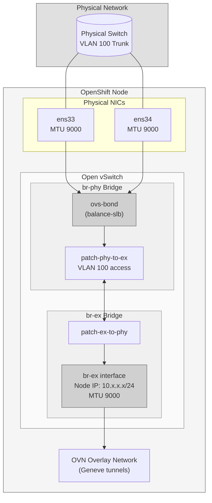
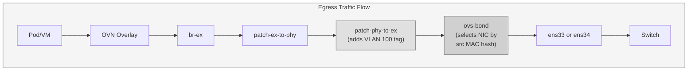
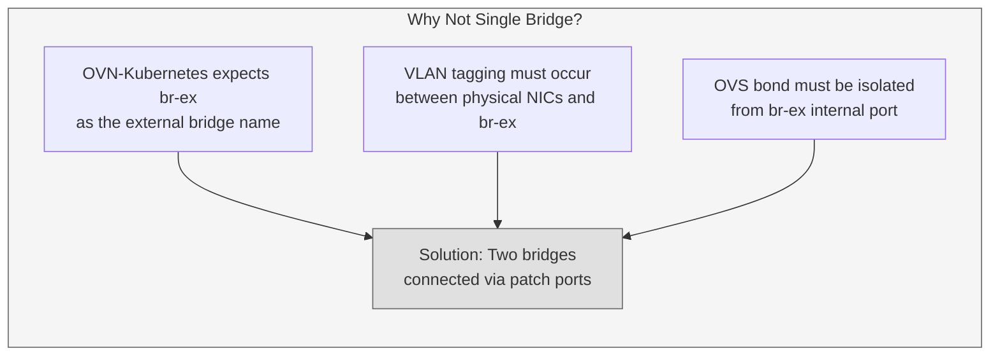
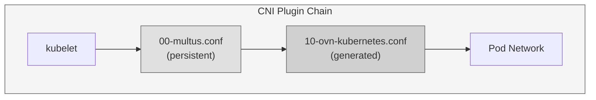
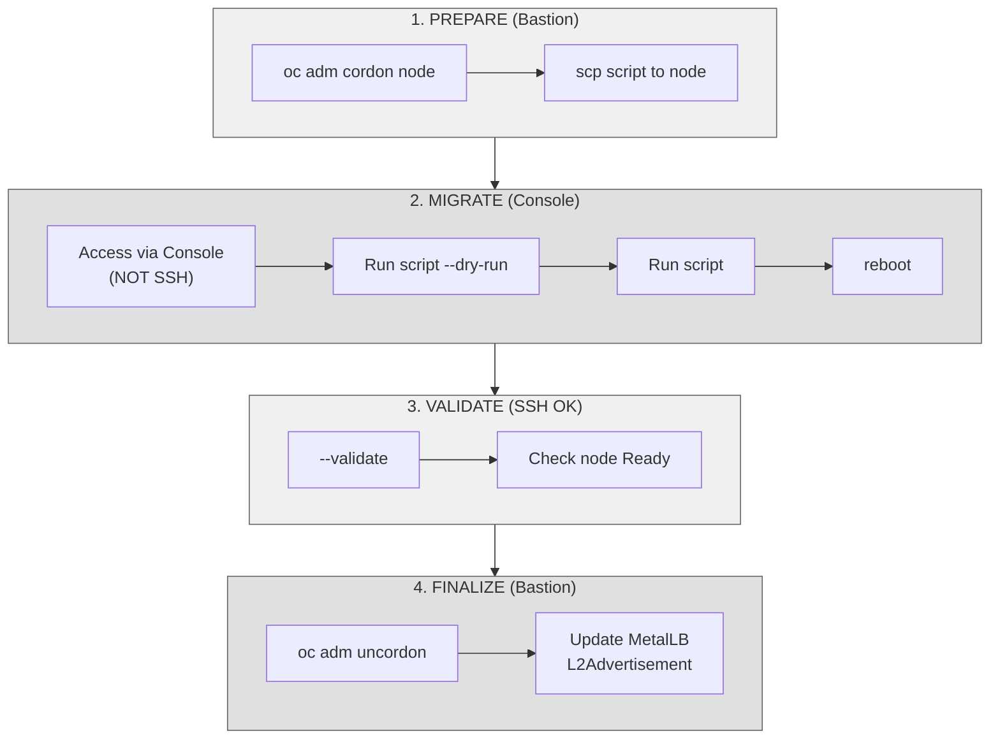
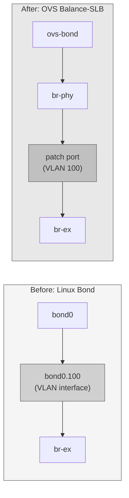

# OVS Balance-SLB Migration Procedure for OpenShift HCP Agent Nodes

## Document Information

| Field | Value |
|-------|-------|
| Version | 2.2 |
| Tested On | OpenShift 4.20.8 (Hosted Control Planes) |
| Last Updated | January 2026 |
| Script Version | migrate-to-ovs-slb.sh v1.6.0 |

---

## Table of Contents

1. [Overview](#1-overview)
2. [Why Manual Configuration is Required](#2-why-manual-configuration-is-required)
3. [Architecture](#3-architecture)
4. [Prerequisites](#4-prerequisites)
5. [Critical Discoveries](#5-critical-discoveries)
6. [Migration Procedure](#6-migration-procedure)
7. [Post-Migration: MetalLB Configuration](#7-post-migration-metallb-configuration)
8. [Cluster-Wide Validation](#8-cluster-wide-validation)
9. [Validation Checklist](#9-validation-checklist)
10. [Troubleshooting Guide](#10-troubleshooting-guide)
11. [Rollback Procedure](#11-rollback-procedure)

---

## 1. Overview

This document describes the procedure to migrate OpenShift HCP (Hosted Control Planes) worker nodes from standard Linux bonding to OVS (Open vSwitch) balance-slb bonding.

Today, customers who need NIC redundancy with only two NICs on bare metal Hosted Control Planes are unable to configure balance-slb end-to-end using only the documented flows.

OVS balance-slb is already a supported and GA mode in OpenShift. What does not yet exist is a documented and specific procedure for Hosted Control Planes in scenarios with only two NICs.

The process developed does not introduce new mechanisms or change the OpenShift network model. It simply applies, in an explicit and controlled manner, the same configurations that OpenShift already applies automatically in traditional flows, reusing the same files and resources already managed by the product.

The goal is not to replace official documentation, but to provide a safe and consistent path until there is an officially documented end-to-end procedure for HCP.

### Target Environment

- OpenShift Hosted Control Planes (HCP) with agent-based installation
- Worker nodes requiring network redundancy without switch-side LAG/LACP configuration
- VLAN-tagged network traffic (trunk ports on physical switches)
- Jumbo frames (MTU 9000) requirement for optimal OVN overlay performance

### Benefits of OVS Balance-SLB

| Feature | Linux Bond (LACP/802.3ad) | OVS Balance-SLB |
|---------|---------------------------|-----------------|
| Load Distribution | Per-flow hash (5-tuple) | Source MAC address hash |
| Switch Requirements | Requires LACP/LAG configuration | No switch configuration needed |
| VM Traffic Distribution | All traffic from one flow uses single link | Traffic distributed by VM MAC address |
| Failover | Requires LACP negotiation | Immediate (no protocol negotiation) |
| OpenShift Integration | External to OVS/OVN stack | Native OVS integration |

#### Technical Note: Balance-SLB Algorithm

OVS balance-slb (Source Load Balancing) uses a hash of the **source MAC address** to determine which bond member transmits each frame. This means:

- Traffic from different VMs (different source MACs) is distributed across bond members
- Traffic from the same VM uses a consistent link (preserving frame ordering)
- No switch-side configuration is required since each link operates independently
- Rebalancing occurs periodically based on observed traffic load (default: every 10 seconds)

This is particularly beneficial for OpenShift Virtualization workloads where multiple VMs generate traffic with distinct MAC addresses.

#### Technical Note: Failover vs Rebalancing

It's important to distinguish between two different timing aspects:

| Aspect | Time | Description |
|--------|------|-------------|
| **Failover** | < 100ms | When a link fails, OVS detects via carrier signal and immediately redirects traffic |
| **Rebalancing** | 10s (default) | Periodic interval when OVS checks utilization and redistributes MACs across links |

The `bond-rebalance-interval` parameter controls only the rebalancing behavior, not failover speed. Link failure detection remains fast regardless of this setting.

---

## 2. Why Manual Configuration is Required

### HCP Limitations

OpenShift Hosted Control Planes have specific constraints that require manual network configuration:

1. **No MachineConfig Operator (MCO)**: HCP worker nodes are not managed by MCO. The Machine Config Operator only runs on standalone/IPI clusters, not on HCP agent-based workers. Network configurations cannot be applied declaratively via MachineConfig CRs.

2. **Agent-based installer limitations**: The `agent-config.yaml` network configuration supports basic bonding modes (active-backup, 802.3ad) but does not support:
   - OVS-native bond modes like balance-slb
   - Complex dual-bridge topologies
   - VLAN access mode on OVS patch ports

3. **OVN-Kubernetes architecture requirements**: The OVN-Kubernetes CNI expects `br-ex` as the external bridge. Custom topologies with additional bridges (br-phy) require manual nmstate configuration.

4. **Post-installation changes**: Changing network architecture after initial deployment requires direct node access since there is no cluster-level operator managing worker node networking in HCP.

### Why Not Day-1 Configuration?

The agent-based installer uses nmstate for network configuration, but the supported schema in `agent-config.yaml` has limitations:

```yaml
# What agent-config.yaml supports:
interfaces:
  - name: bond0
    type: bond
    link-aggregation:
      mode: 802.3ad  # or active-backup, balance-xor
      # balance-slb is NOT supported here
```

The dual-bridge architecture with OVS-native bonding requires direct nmstate configuration that bypasses the agent installer's schema validation.

---

## 3. Architecture

### Network Topology



### Data Flow Diagram



### Component Description

| Component | Type | Purpose | Technical Details |
|-----------|------|---------|-------------------|
| ens33, ens34 | Physical NICs | Uplinks to physical switch | Must support MTU 9000; connected to trunk ports |
| ovs-bond | OVS Bond | Link aggregation with balance-slb | Hash algorithm: source MAC; no LACP required |
| br-phy | OVS Bridge | Physical network termination | Holds bond and applies VLAN tagging via patch port |
| patch-phy-to-ex | OVS Patch Port | Inter-bridge connection | VLAN access mode: tag 100 (strips/adds VLAN tag) |
| patch-ex-to-phy | OVS Patch Port | Inter-bridge connection | Peer of patch-phy-to-ex; untagged side |
| br-ex | OVS Bridge | External bridge for OVN | Required by OVN-Kubernetes; holds node IP |
| br-ex (interface) | OVS Internal Port | L3 interface | Node IP address; must have MTU 9000 |

### Why Two Bridges?

The dual-bridge architecture is required for the following technical reasons:



**Detailed Explanation:**

1. **br-ex is mandatory**: OVN-Kubernetes hardcodes `br-ex` as the external bridge name. The `ovnkube-node` daemon expects to find this bridge and configures OVN flows accordingly. Renaming or using a different bridge breaks OVN integration.

2. **VLAN isolation requirement**: The physical switch sends tagged traffic (VLAN 100). This tag must be removed before traffic reaches `br-ex` (which operates untagged). OVS patch ports with VLAN access mode provide this translation.

3. **Bond placement**: An OVS bond cannot be directly attached to `br-ex` while also applying VLAN access mode. The bond must exist on a separate bridge (`br-phy`) with the VLAN-translating patch port.

4. **Patch port VLAN semantics**: When a patch port has `vlan: { mode: access, tag: 100 }`, OVS:
   - **Ingress (from br-phy)**: Strips VLAN 100 tag before forwarding to br-ex
   - **Egress (to br-phy)**: Adds VLAN 100 tag before forwarding to the bond

---

## 4. Prerequisites

### MANDATORY: Console Access

> **CRITICAL**: The migration script MUST be run from a local console (IPMI/iLO/iDRAC KVM, or physical keyboard). SSH sessions WILL be disconnected when nmstate reconfigures the network stack.

### Pre-Migration Checklist

| # | Requirement | Verification | Notes |
|---|-------------|--------------|-------|
| 1 | Core user password set | `sudo grep core /etc/shadow` | Must show password hash, not `*` or `!` |
| 2 | Console access verified | Login as core via console | Test before starting migration |
| 3 | Node cordoned | `oc adm cordon <node-name>` | Prevents new pod scheduling |
| 4 | Workloads drained (optional) | `oc adm drain <node-name> --ignore-daemonsets` | For zero-impact migration |
| 5 | Physical switch configured | Trunk port with VLAN allowed | Both switch ports must allow VLAN 100 |
| 6 | Other nodes healthy | `oc get nodes` | Ensure cluster stability |
| 7 | Jumbo frames enabled | Switch ports configured for MTU 9000+ | End-to-end path must support jumbo |

### Setting Core User Password

If the core user doesn't have a password set:

```bash
# On the node (via existing SSH while it still works)
sudo passwd core
# Enter and confirm password

# Verify password is set
sudo grep core /etc/shadow
# Should show: core:$6$...:... (hashed password)
```

### Physical Switch Requirements

For OVS balance-slb, the physical switch ports must be configured as:

```
# Cisco IOS example (per port)
interface GigabitEthernet0/1
  switchport mode trunk
  switchport trunk allowed vlan 100
  mtu 9216

# Dell OS10 example (per port)  
interface ethernet1/1/1
  switchport mode trunk
  switchport trunk allowed vlan 100
  mtu 9216
```

**Important**: Unlike LACP bonding, balance-slb does NOT require port-channel/LAG configuration on the switch. Each port operates independently.

---

## 5. Critical Discoveries

These are lessons learned during development and testing. **Pay close attention to these points.**

### 5.1 MTU Mismatch (CRITICAL)

**Problem**: After applying nmstate, `ovnkube-controller` enters crash loop with error:
```
MTU (1500) of network interface br-ex is too small for specified overlay MTU (8958)
```

**Root Cause**: OVN-Kubernetes calculates the maximum overlay MTU based on the `br-ex` interface MTU. The formula used is:

```
overlay_mtu = br-ex_mtu - geneve_overhead
```

Where `geneve_overhead` accounts for:
- Outer Ethernet header: 14 bytes
- Outer IP header: 20 bytes  
- UDP header: 8 bytes
- Geneve base header: variable (minimum 8 bytes)

In this environment: `9000 - 42 = 8958` bytes for overlay MTU.

If `br-ex` has the default MTU of 1500, the calculated overlay MTU (1458) is insufficient for the cluster's configured overlay network.

**Solution**: The nmstate configuration MUST include explicit MTU on the `br-ex` OVS internal interface:

```yaml
- name: br-ex
  type: ovs-interface  # This is the internal port, not the bridge
  state: up
  mtu: 9000  # CRITICAL - must match physical MTU
  ipv4:
    enabled: true
    address:
    - ip: 10.132.254.25
      prefix-length: 24
```

### 5.2 NMState File Path (Product-Provided Interface)

**Important**: OpenShift provides a specific path for nmstate configurations that integrates with the `nmstate-configuration` service.

**Correct Path**: `/etc/nmstate/openshift/$(hostname -s).yml`

When using this path:
- The `nmstate-configuration` service automatically detects the file
- The `applied` flag is managed automatically (no manual creation needed)
- Bridge cleanup (br-ex) is handled automatically in recent z-streams
- The `configure-ovs.sh` script respects this configuration

**Incorrect Path**: `/etc/nmstate/$(hostname -s).yml`

Using the root `/etc/nmstate/` path requires manual workarounds:
- Manual creation of `/etc/nmstate/openshift/applied` flag
- Manual deletion of existing br-ex bridge
- Risk of `configure-ovs.sh` overwriting configuration

**Best Practice**: Always use the product-provided interface at `/etc/nmstate/openshift/`.

### 5.3 CNI Configuration Files

**Discovery**: Two CNI configuration files are required for proper node networking:



| File | Location | Source | Behavior |
|------|----------|--------|----------|
| `00-multus.conf` | `/etc/kubernetes/cni/net.d/` | Persistent on disk | Multus meta-plugin; delegates to other CNIs |
| `10-ovn-kubernetes.conf` | `/run/multus/cni/net.d/` | Generated by ovnkube-node | Created when ovnkube-node starts successfully |

**Technical Details**:

- The numeric prefix (00, 10) determines plugin execution order
- Multus reads `00-multus.conf` first and acts as a meta-plugin
- Multus then delegates to `10-ovn-kubernetes.conf` for the default network
- If `00-multus.conf` is missing, pods cannot be scheduled (CNI not ready)
- If `10-ovn-kubernetes.conf` is missing, check `ovnkube-node` pod status

### 5.4 Automatic Bridge Cleanup (Recent Z-Streams)

**Background**: In older OpenShift versions, existing OVS bridges had to be manually deleted before applying new nmstate configuration.

**Current Behavior** (recent z-streams): When using the product-provided path (`/etc/nmstate/openshift/`), the `nmstate-configuration` service automatically handles:
- Detection of existing br-ex bridge
- Cleanup of conflicting configurations
- Application of the new nmstate file

**Note**: The migration script (v1.6.0+) no longer includes manual bridge deletion steps, relying on this automatic cleanup.

### 5.5 Reboot Required for Stable Operation

**Discovery**: While `nmstatectl apply` configures the network immediately, a full reboot is required for:

1. **OVS daemon state synchronization**: OVS daemons (ovs-vswitchd, ovsdb-server) may have cached state that doesn't fully update
2. **NetworkManager integration**: NM may hold references to old configurations
3. **Kubelet network plugin reinitialization**: The CNI plugin chain needs clean initialization
4. **OVN controller reconnection**: ovnkube-node needs to re-establish flows with the new bridge topology

**Recommendation**: Always reboot after applying nmstate configuration. Do not attempt to restart individual services as a substitute.

---

## 6. Migration Procedure

### Migration Workflow Overview



### 6.1 Automated Method (Recommended)

Use the provided migration script for consistent, validated migrations.

#### Step 1: Cordon the Node

```bash
# From bastion
oc adm cordon <node-name>

# Verify node is cordoned
oc get node <node-name>
# STATUS should show: Ready,SchedulingDisabled
```

#### Step 2: Transfer Script to Node

```bash
# From bastion
scp migrate-to-ovs-slb.sh core@<node-ip>:/tmp/
```

#### Step 3: Access Node Console

> **Use VMware Console, IPMI, iLO, iDRAC, or physical access. Do NOT use SSH.**

```bash
# From console, login as core, then:
sudo -i
cd /tmp
chmod +x migrate-to-ovs-slb.sh
```

#### Step 4: Run Migration (Dry-Run First)

```bash
# Dry-run to verify configuration without making changes
./migrate-to-ovs-slb.sh \
--ip 10.132.254.25 \
--prefix 24 \
--gateway 10.132.254.10 \
--dns1 10.132.254.103 \
--dns2 10.132.254.104 \
--nic1 eno1 \
--nic2 eno2 \
--vlan 100 --dry-run
```

Carefully **review the result**, and then execute it for real (remove the `--dry-run` parameter from the command).


#### Script Parameters

| Parameter | Default | Description |
|-----------|---------|-------------|
| `--ip` | (required) | Node IP address |
| `--prefix` | 24 | Network prefix length (CIDR notation) |
| `--gateway` | 10.132.254.10 | Default gateway IP |
| `--dns1` | 10.132.254.102 | Primary DNS server |
| `--dns2` | 10.132.254.103 | Secondary DNS server |
| `--nic1` | ens33 | First physical NIC name |
| `--nic2` | ens34 | Second physical NIC name |
| `--vlan` | 100 | VLAN tag for access mode |
| `--mtu` | 9000 | MTU size (must match switch) |
| `--dry-run` | false | Preview changes without applying |
| `--validate` | - | Run post-reboot validation only |
| `--failover-test` | - | Run invasive bond failover test |

#### Step 5: Reboot the Node

```bash
# After script completes successfully
reboot
```

#### Step 6: Validate After Reboot

```bash
# SSH now works - connect from bastion
ssh core@<node-ip>
sudo /tmp/migrate-to-ovs-slb.sh \
--validate \
--nic1 eno1 \
--nic2 eno2 \
--gateway 10.132.254.10
```

#### Step 7: Uncordon the Node

> **IMPORTANT**: If you are reconfiguring a cluster that uses `br-vmdata`, make sure to adjust the node's NNCP before uncordoning to avoid VM downtime.

```bash
# From bastion, after validation passes
oc adm uncordon <node-name>

# Verify node is Ready and schedulable
oc get node <node-name>
```

---

### 6.2 Manual Method

For environments where the script cannot be used, or for understanding the underlying operations.

#### Phase 1: Backup

```bash
sudo -i

# Create backup directory structure
mkdir -p /root/backup-migration/cni

# Backup NetworkManager connection profiles
cp -a /etc/NetworkManager/system-connections/* /root/backup-migration/

# Backup CNI configuration
cp -a /etc/kubernetes/cni/net.d/* /root/backup-migration/cni/

# Backup generated OVN CNI config if it exists
cp /run/multus/cni/net.d/10-ovn-kubernetes.conf /root/backup-migration/cni/ 2>/dev/null || true

# Verify backup contents
ls -la /root/backup-migration/
ls -la /root/backup-migration/cni/
```

#### Phase 2: Prepare Environment

```bash
# Clear NetworkManager connection profiles (prevents conflicts)
rm -f /etc/NetworkManager/system-connections/*

# Create the openshift nmstate directory
# Using /etc/nmstate/openshift/ is the product-provided interface
mkdir -p /etc/nmstate/openshift
```

> **Note**: When using the `/etc/nmstate/openshift/` path, you do NOT need to manually create the `applied` flag file. The `nmstate-configuration` service handles this automatically.

#### Phase 3: Create NMState Configuration

```bash
# Get hostname for correct file naming
HOSTNAME=$(hostname -s)
echo "Creating /etc/nmstate/openshift/${HOSTNAME}.yml"

cat > /etc/nmstate/openshift/${HOSTNAME}.yml << 'EOF'
interfaces:
  # br-ex bridge definition
  - name: br-ex
    type: ovs-bridge
    state: up
    ipv4:
      enabled: false
      dhcp: false
    ipv6:
      enabled: false
      dhcp: false
    bridge:
      allow-extra-patch-ports: true
      port:
      - name: br-ex        # Internal port (same name as bridge)
      - name: patch-ex-to-phy
    ovs-db:
      external_ids:
        bridge-uplink: "patch-ex-to-phy"  # Tells OVN which port is uplink

  # br-ex internal interface (L3 endpoint)
  - name: br-ex
    type: ovs-interface
    state: up
    mtu: 9000              # CRITICAL: Must match physical MTU
    copy-mac-from: ens33   # Inherit MAC from first physical NIC
    ipv4:
      enabled: true
      address:
      - ip: 10.132.254.25  # <-- CHANGE THIS FOR EACH NODE
        prefix-length: 24
    ipv6:
      enabled: false
      dhcp: false

  # br-phy bridge definition (physical network termination)
  - name: br-phy
    type: ovs-bridge
    state: up
    mtu: 9000
    ipv4:
      enabled: false
      dhcp: false
    ipv6:
      enabled: false
      dhcp: false
    bridge:
      allow-extra-patch-ports: true
      port:
      - name: patch-phy-to-ex
        vlan:
          mode: access     # VLAN access mode
          tag: 100         # <-- CHANGE IF DIFFERENT VLAN
      - name: ovs-bond
        link-aggregation:
          mode: balance-slb  # OVS-native bonding mode
          port:
          - name: ens33      # <-- CHANGE IF DIFFERENT NIC NAMES
          - name: ens34      # <-- CHANGE IF DIFFERENT NIC NAMES

  # Patch port on br-ex side
  - name: patch-ex-to-phy
    type: ovs-interface
    state: up
    patch:
      peer: patch-phy-to-ex

  # Patch port on br-phy side (with VLAN tagging)
  - name: patch-phy-to-ex
    type: ovs-interface
    state: up
    patch:
      peer: patch-ex-to-phy

  # Physical NIC 1
  - name: ens33
    type: ethernet
    state: up
    mtu: 9000
    ipv4:
      enabled: false
    ipv6:
      enabled: false

  # Physical NIC 2
  - name: ens34
    type: ethernet
    state: up
    mtu: 9000
    ipv4:
      enabled: false
    ipv6:
      enabled: false

dns-resolver:
  config:
    server:
    - 10.132.254.102
    - 10.132.254.103

routes:
  config:
  - destination: 0.0.0.0/0
    next-hop-address: 10.132.254.10  # <-- CHANGE IF DIFFERENT GATEWAY
    next-hop-interface: br-ex
EOF
```

> **Adjust the following for each node**: IP address, VLAN tag, NIC names, gateway, DNS servers

#### Phase 4: Apply Configuration

```bash
# Apply nmstate configuration
# NOTE: In recent z-streams, bridge cleanup is handled automatically
# when using the /etc/nmstate/openshift/ path
cd /etc/nmstate/openshift
nmstatectl apply ${HOSTNAME}.yml

# Note: Network connectivity may be briefly interrupted here
```

#### Phase 5: Verify CNI Files

```bash
# Ensure 00-multus.conf exists
ls -la /etc/kubernetes/cni/net.d/

# If missing, restore from backup
if [[ ! -f /etc/kubernetes/cni/net.d/00-multus.conf ]]; then
    echo "Restoring 00-multus.conf from backup..."
    cp /root/backup-migration/cni/00-multus.conf /etc/kubernetes/cni/net.d/
fi
```

#### Phase 6: Reboot

```bash
reboot
```

#### Phase 7: Post-Reboot Validation

After reboot, verify the configuration:

```bash
# Check bond status and mode
ovs-appctl bond/show ovs-bond

# Verify OVS bridge structure
ovs-vsctl show

# Check MTU on all relevant interfaces
ip link show br-ex | grep mtu    # Should be 9000
ip link show ens33 | grep mtu    # Should be 9000
ip link show ens34 | grep mtu    # Should be 9000

# Verify IP address assignment
ip addr show br-ex

# Test gateway connectivity
ping -c 3 10.132.254.10
```

---

## 7. Post-Migration: MetalLB Configuration

### Required Change

After migrating to OVS balance-slb, the Linux VLAN interface `bond0.100` **no longer exists**. VLAN tagging is now handled internally by OVS patch ports.

### Before vs After Architecture



### Update L2Advertisement

For each Hosted Cluster using MetalLB, update the L2Advertisement to remove the obsolete interface reference:

```bash
# From bastion - edit the L2Advertisement
oc -n metallb-system edit l2advertisement <hc-name>-l2-advertisement
```

**Before (Linux bond configuration):**
```yaml
apiVersion: metallb.io/v1beta1
kind: L2Advertisement
metadata:
  name: cluster-workload-linux-l2-advertisement
  namespace: metallb-system
spec:
  ipAddressPools:
    - cluster-workload-linux-ips
  interfaces:
    - br-ex
    - bond0.100    # ← REMOVE THIS LINE
```

**After (OVS balance-slb configuration):**
```yaml
apiVersion: metallb.io/v1beta1
kind: L2Advertisement
metadata:
  name: cluster-workload-linux-l2-advertisement
  namespace: metallb-system
spec:
  ipAddressPools:
    - cluster-workload-linux-ips
  interfaces:
    - br-ex        # Only br-ex is needed
```

### Verify Interface Status

```bash
# On any migrated node, confirm bond0.100 no longer exists
ip link show bond0.100
# Expected output: Device "bond0.100" does not exist.

# Confirm br-ex exists with correct configuration
ip addr show br-ex
ovs-vsctl show | grep -A5 br-ex
```

### Apply to All Hosted Clusters

Repeat for each Hosted Cluster's L2Advertisement:

```bash
# List all L2Advertisements
oc -n metallb-system get l2advertisement

# Example output:
# NAME                                      AGE
# cluster-workload-linux-l2-advertisement   30d
# cluster-workload-dev-l2-advertisement     15d

# Edit each one to remove bond0.100
oc -n metallb-system edit l2advertisement cluster-workload-linux-l2-advertisement
oc -n metallb-system edit l2advertisement cluster-workload-dev-l2-advertisement
```

---

## 8. Cluster-Wide Validation

### Using the Cluster Check Script

After migrating all nodes, verify the entire cluster from the bastion:

```bash
# Check all nodes in the cluster
./check-cluster-bond.sh

# Check with verbose output (shows bond details)
./check-cluster-bond.sh --verbose

# Check only worker nodes
./check-cluster-bond.sh --label node-role.kubernetes.io/worker

# Check specific nodes
./check-cluster-bond.sh --nodes ocp-worker-01,ocp-worker-02
```

### Expected Output

```
===============================================================================
 OVS Balance-SLB Cluster Verification v1.0.0
===============================================================================

[INFO] Checking prerequisites...
[OK] Connected to cluster as 'admin'
  Server: https://api.management.example.com:6443

[INFO] Discovering nodes...
  Found 3 node(s) to check

NODE                                     BOND MODE       STATUS     MTU      BR-EX IP
---------------------------------------- --------------- ---------- -------- ---------------
ocp-worker-01                            balance-slb     OK (2)     9000     10.132.254.25
ocp-worker-02                            balance-slb     OK (2)     9000     10.132.254.26
ocp-worker-03                            balance-slb     OK (2)     9000     10.132.254.27

===============================================================================
 Summary
===============================================================================

  Total nodes checked:     3
  Configured (balance-slb): 3
  Not configured:          0

[OK] All nodes are configured with OVS balance-slb!
```

### Interpreting Results

| Status | Meaning | Action Required |
|--------|---------|-----------------|
| `balance-slb` | Correctly configured | None |
| `NO BOND` | Bond not found | Node needs migration |
| `OK (2)` | Both members enabled | None |
| `OK (1)` | Only one member enabled | Check physical link/switch |
| `DEGRADED` | Bond has issues | Investigate bond health |

---

## 9. Validation Checklist

### Per-Node Validation

| # | Check | Command | Expected Result |
|---|-------|---------|-----------------|
| 1 | Bond mode | `ovs-appctl bond/show ovs-bond \| grep bond_mode` | `bond_mode: balance-slb` |
| 2 | Bond members | `ovs-appctl bond/show ovs-bond \| grep may_enable` | Two lines with `may_enable: true` |
| 3 | br-ex MTU | `ip link show br-ex \| grep mtu` | `mtu 9000` |
| 4 | Physical NIC MTU | `ip link show ens33 \| grep mtu` | `mtu 9000` |
| 5 | br-ex IP | `ip -4 addr show br-ex` | Correct IP address assigned |
| 6 | Gateway reachable | `ping -c 3 <gateway>` | 0% packet loss |
| 7 | OVS structure | `ovs-vsctl show` | Shows br-ex, br-phy, patch ports, ovs-bond |
| 8 | CNI ready | `ls /etc/kubernetes/cni/net.d/` | `00-multus.conf` present |
| 9 | Services running | `systemctl is-active kubelet crio` | Both show `active` |
| 10 | Node status | `oc get node <n>` | Shows `Ready` |

### Cluster-Wide Validation

| # | Check | Command | Expected Result |
|---|-------|---------|-----------------|
| 1 | All nodes Ready | `oc get nodes` | All nodes show `Ready` |
| 2 | All bonds configured | `./check-cluster-bond.sh` | All show `balance-slb` |
| 3 | MetalLB updated | `oc -n metallb-system get l2advertisement -o yaml \| grep -c bond0.100` | Returns `0` |
| 4 | Hosted Clusters healthy | `oc get hostedcluster -A` | All show `Available: True` |

---

## 10. Troubleshooting Guide

### 10.1 ovnkube-controller Crash Loop (MTU Error)

**Symptom:**
```
MTU (1500) of network interface br-ex is too small for specified overlay MTU (8958)
```

**Root Cause**: br-ex interface MTU is 1500 (default) instead of 9000.

**Diagnosis:**
```bash
ip link show br-ex | grep mtu
# If output shows "mtu 1500" - this is the problem
```

**Solution:**
```bash
# Immediate fix (temporary - won't survive reboot)
ip link set br-ex mtu 9000
systemctl restart kubelet

# Permanent fix
vi /etc/nmstate/openshift/$(hostname -s).yml
# Ensure the br-ex ovs-interface section has: mtu: 9000

# Reapply and reboot
nmstatectl apply /etc/nmstate/openshift/$(hostname -s).yml
reboot
```

### 10.2 kube-multus Crash Loop

**Symptom:**
```
error getting default network: failed to get default network...
```

**Root Cause**: `/etc/kubernetes/cni/net.d/00-multus.conf` is missing.

**Diagnosis:**
```bash
ls -la /etc/kubernetes/cni/net.d/
# If 00-multus.conf is missing, this is the problem
```

**Solution:**
```bash
# Restore from backup
cp /root/backup-migration/cni/00-multus.conf /etc/kubernetes/cni/net.d/

# Restart CRI-O to re-trigger CNI setup
systemctl restart crio

# Verify file exists
ls -la /etc/kubernetes/cni/net.d/00-multus.conf
```

### 10.3 No Connectivity After nmstatectl apply

**Symptom**: Cannot ping gateway, node unreachable via network.

**Diagnosis (via console):**
```bash
# Check if bridges exist
ovs-vsctl list-br
# Should show: br-ex, br-phy

# Check bridge structure
ovs-vsctl show

# Check IP assignment
ip addr show br-ex

# Check routes
ip route
```

**Possible Causes:**
1. nmstate apply failed silently
2. Incorrect IP/gateway configuration
3. VLAN tag mismatch with switch

**Solution:**
```bash
# Try reapplying nmstate
cd /etc/nmstate/openshift
nmstatectl apply $(hostname -s).yml

# If that fails, rollback (see Section 11)
```

### 10.4 Bond Showing Only One Active Member

**Symptom:**
```bash
ovs-appctl bond/show ovs-bond
# Shows one member with "may_enable: false"
```

**Possible Causes:**
1. Physical cable disconnected
2. Switch port down or misconfigured
3. Interface not brought up

**Diagnosis:**
```bash
# Check physical link state
ip link show ens33  # Look for "state UP" or "state DOWN"
ip link show ens34

# Check carrier signal
cat /sys/class/net/ens33/carrier  # 1 = link, 0 = no link
cat /sys/class/net/ens34/carrier
```

**Solution:**
```bash
# Bring interfaces up
ip link set ens33 up
ip link set ens34 up

# If carrier is 0, check:
# - Physical cable connection
# - Switch port status
# - Switch port configuration (must be trunk with VLAN allowed)
```

### 10.5 10-ovn-kubernetes.conf Not Created

**Symptom**: File missing in `/run/multus/cni/net.d/`

**Root Cause**: This file is generated by `ovnkube-node` pod when it starts successfully. If the pod is not running, the file won't be created.

**Diagnosis:**
```bash
# Check ovnkube-node container status
crictl ps -a | grep ovnkube-node

# Check for errors in container logs
crictl logs $(crictl ps -a | grep ovnkube-node | awk '{print $1}')
```

**Solution:**
```bash
# Usually resolves itself once ovnkube-node starts successfully
# If ovnkube-node is crash-looping, check for:
# - MTU issues (see 10.1)
# - br-ex bridge existence
# - Connectivity to OVN components

# Force restart
systemctl restart kubelet
```

### 10.6 Script Blocks SSH Execution

**Symptom:**
```
This script cannot be run via SSH!
Network reconfiguration will disconnect your session.
```

**Explanation**: This is intentional safety behavior. The migration script reconfigures networking, which will terminate SSH connections.

**Solution:**
Use proper console access:
- VMware Console
- IPMI/iLO/iDRAC KVM
- Physical keyboard/monitor

**Override (NOT RECOMMENDED):**
```bash
./migrate-to-ovs-slb.sh --ip 10.132.254.25 --force-ssh
# You will be prompted to type "I UNDERSTAND"
# Your SSH session WILL disconnect during migration
```

---

## 11. Rollback Procedure

### When to Rollback

- Node is not reachable after migration
- Node stays in `NotReady` state after multiple troubleshooting attempts
- Critical workloads need immediate recovery

### Via Node Console

```bash
sudo -i

# Step 1: Remove custom nmstate configuration
rm -f /etc/nmstate/openshift/$(hostname -s).yml

# Step 2: Remove OVS bridges created by our configuration
ovs-vsctl del-br br-phy 2>/dev/null || true
ovs-vsctl del-br br-ex 2>/dev/null || true

# Step 3: Restore original NetworkManager connections
cp -a /root/backup-migration/*.nmconnection /etc/NetworkManager/system-connections/ 2>/dev/null || true

# Step 4: Restore CNI configuration
cp -a /root/backup-migration/cni/* /etc/kubernetes/cni/net.d/

# Step 5: Reboot to apply original configuration
reboot
```

### Verify Rollback Success

After reboot:
```bash
# Check original Linux bond is restored
ip link show bond0
ip link show bond0.100

# Check node rejoins cluster
# From bastion:
oc get nodes
```

### Post-Rollback Actions

If rollback was necessary:
1. Document what went wrong
2. Review nmstate configuration for errors
3. Check physical switch configuration
4. Retry migration after fixing issues

---

## Appendix A: Quick Reference Card

### Migration Commands Summary

```bash
# 1. PREPARE (Bastion)
oc adm cordon <node-name>
scp migrate-to-ovs-slb.sh core@<node-ip>:/tmp/

# 2. MIGRATE (Console - NOT SSH!)
sudo -i
cd /tmp
./migrate-to-ovs-slb.sh --ip <NODE_IP> --dry-run  # Preview
./migrate-to-ovs-slb.sh --ip <NODE_IP>            # Apply

# 3. REBOOT (Console)
reboot

# 4. VALIDATE (SSH OK after reboot)
./migrate-to-ovs-slb.sh --validate

# 5. FINALIZE (Bastion)
oc adm uncordon <node-name>
oc -n metallb-system edit l2advertisement <hc>-l2-advertisement
# → Remove bond0.100 from interfaces list
```

### Essential Verification Commands

```bash
# Check bond status
ovs-appctl bond/show ovs-bond

# Check OVS configuration
ovs-vsctl show

# Check MTU (all should be 9000)
ip link show br-ex | grep mtu

# Check node status
oc get nodes -o wide

# Cluster-wide check
./check-cluster-bond.sh
```

---

## Appendix B: Files Reference

| File | Purpose |
|------|---------|
| `/etc/nmstate/openshift/<hostname>.yml` | NMState network configuration (product-provided path) |
| `/etc/kubernetes/cni/net.d/00-multus.conf` | Multus CNI configuration (persistent) |
| `/run/multus/cni/net.d/10-ovn-kubernetes.conf` | OVN CNI configuration (generated by ovnkube-node) |
| `/root/backup-migration/` | Backup directory for rollback |
| `/var/log/ovs-slb-migration.log` | Migration script log file |

---

## Appendix C: Script Files

| Script | Version | Purpose | Run From |
|--------|---------|---------|----------|
| `migrate-to-ovs-slb.sh` | v1.6.0 | Main migration script | Node console |
| `check-cluster-bond.sh` | v1.0.0 | Cluster-wide validation | Bastion |

---

## Appendix D: NMState Configuration Reference

### Complete Annotated Example

```yaml
# /etc/nmstate/openshift/<hostname>.yml
# OVS Balance-SLB configuration for OpenShift HCP nodes
# NOTE: Use /etc/nmstate/openshift/ path for automatic integration
#       with the nmstate-configuration service

interfaces:
  #---------------------------------------------------------------------------
  # br-ex: OVS Bridge (container for internal port and patch port)
  #---------------------------------------------------------------------------
  - name: br-ex
    type: ovs-bridge
    state: up
    ipv4:
      enabled: false      # Bridge itself has no IP
      dhcp: false
    ipv6:
      enabled: false
      dhcp: false
    bridge:
      allow-extra-patch-ports: true  # Allow OVN to add ports
      port:
      - name: br-ex                   # Internal port (same name)
      - name: patch-ex-to-phy         # Patch to br-phy
    ovs-db:
      external_ids:
        bridge-uplink: "patch-ex-to-phy"  # OVN uses this to identify uplink

  #---------------------------------------------------------------------------
  # br-ex: OVS Internal Interface (L3 endpoint with node IP)
  #---------------------------------------------------------------------------
  - name: br-ex
    type: ovs-interface   # Internal port, not the bridge
    state: up
    mtu: 9000             # CRITICAL for OVN overlay
    copy-mac-from: ens33  # Consistent MAC address
    ipv4:
      enabled: true
      address:
      - ip: 10.132.254.25     # Node IP address
        prefix-length: 24
    ipv6:
      enabled: false
      dhcp: false

  #---------------------------------------------------------------------------
  # br-phy: OVS Bridge for physical network termination
  #---------------------------------------------------------------------------
  - name: br-phy
    type: ovs-bridge
    state: up
    mtu: 9000
    ipv4:
      enabled: false
      dhcp: false
    ipv6:
      enabled: false
      dhcp: false
    bridge:
      allow-extra-patch-ports: true
      port:
      - name: patch-phy-to-ex
        vlan:
          mode: access        # Access mode = untagged on one side
          tag: 100            # VLAN tag to add/remove
      - name: ovs-bond
        link-aggregation:
          mode: balance-slb   # OVS-native bonding
          port:
          - name: ens33
          - name: ens34

  #---------------------------------------------------------------------------
  # Patch ports: Connect br-ex and br-phy
  #---------------------------------------------------------------------------
  - name: patch-ex-to-phy
    type: ovs-interface
    state: up
    patch:
      peer: patch-phy-to-ex   # Must match peer name exactly

  - name: patch-phy-to-ex
    type: ovs-interface
    state: up
    patch:
      peer: patch-ex-to-phy   # Must match peer name exactly

  #---------------------------------------------------------------------------
  # Physical NICs: Bond members
  #---------------------------------------------------------------------------
  - name: ens33
    type: ethernet
    state: up
    mtu: 9000
    ipv4:
      enabled: false          # No IP on physical NICs
    ipv6:
      enabled: false

  - name: ens34
    type: ethernet
    state: up
    mtu: 9000
    ipv4:
      enabled: false
    ipv6:
      enabled: false

#-----------------------------------------------------------------------------
# DNS Configuration
#-----------------------------------------------------------------------------
dns-resolver:
  config:
    server:
    - 10.132.254.102
    - 10.132.254.103

#-----------------------------------------------------------------------------
# Routing Configuration
#-----------------------------------------------------------------------------
routes:
  config:
  - destination: 0.0.0.0/0
    next-hop-address: 10.132.254.10
    next-hop-interface: br-ex
```

---

## Appendix E: Bond Tuning (Optional)

### Rebalance Interval

OVS balance-slb periodically redistributes traffic across bond members based on utilization. The default interval is 10 seconds.

| Interval | Use Case |
|----------|----------|
| **10s** (default) | Dynamic environments, frequent VM creation/deletion |
| **30s** (tuned) | Stable VMs, large environments, bursty traffic patterns |

> **Note**: This setting affects only periodic rebalancing, not failover speed. Link failure detection remains under 100ms regardless of this parameter.

### Configuring via HCP ConfigMap

For HCP clusters, use a ConfigMap with MachineConfig to inject a systemd unit:

```yaml
apiVersion: v1
kind: ConfigMap
metadata:
  name: ovs-bond-tuning
  namespace: <hosted-cluster-namespace>
data:
  config: |
    apiVersion: machineconfiguration.openshift.io/v1
    kind: MachineConfig
    metadata:
      labels:
        machineconfiguration.openshift.io/role: worker
      name: 99-ovs-bond-tuning
    spec:
      config:
        ignition:
          version: 3.2.0
        systemd:
          units:
          - name: ovs-bond-tuning.service
            enabled: true
            contents: |
              [Unit]
              Description=OVS Bond Rebalance Interval Tuning
              After=openvswitch.service ovs-vswitchd.service
              Requires=openvswitch.service

              [Service]
              Type=oneshot
              ExecStartPre=/usr/bin/sleep 5
              ExecStart=/usr/bin/ovs-vsctl set port ovs-bond other_config:bond-rebalance-interval=30000
              RemainAfterExit=yes

              [Install]
              WantedBy=multi-user.target
```

Reference the ConfigMap in the NodePool:

```yaml
spec:
  config:
  - name: ovs-bond-tuning
```

### Verification

```bash
ovs-vsctl get port ovs-bond other_config
# Expected: {bond-rebalance-interval="30000"}
```

### Known Limitation

The `bond-rebalance-interval` parameter cannot be configured via nmstate/NNCP. The nmstate schema does not expose this OVS-specific setting. The ConfigMap/MachineConfig approach is the supported method for HCP environments.

---

*Document maintained by Infrastructure Team*  
*Last technical review: January 2026*